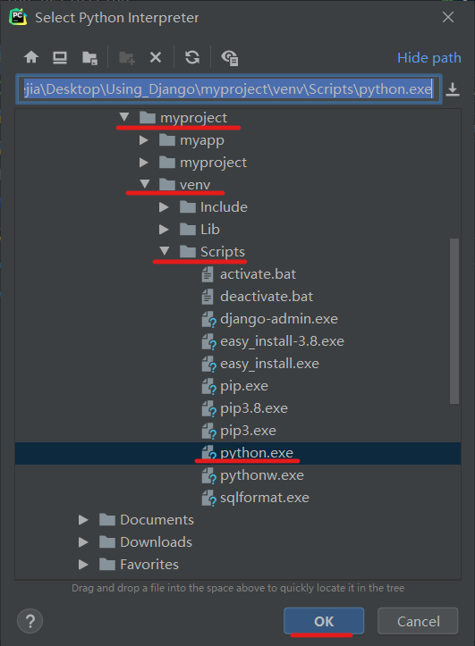

Pycharm方式


---
windows 命令行方式  
[mysqlclient下载](https://pypi.org/project/mysqlclient/#files), 文件名中的 'win_amd64' 重命名为 'win32' 
```shell script
mkdir myproject
cd myproject
# 创建虚拟环境
python -m venv venv
# 激活虚拟环境
.\venv\Scripts\activate.bat
# 升级pip, 如有报错忽略
pip install -U pip
# 安装依赖
pip install mysqlclient-2.0.1-cp38-cp38-win32.whl
pip install django djangorestframework
# 导出依赖至requirements.txt
pip freeze > requirements.txt
# 通过requirements.txt 安装依赖: pip install -r requirements.txt
# 创建Django项目
django-admin startproject myproject .
# 创建Django app
django-admin startapp myapp
```
通过命令行创建的项目, 需要在Pycharm中手动设置Python解释器


---

---

---

版本控制 命令行
```shell
# 在git bash中运行
echo venv/ .idea/ __pycache__/ media/ *.log *.sqlite3 > .gitignore
git init && git add . && git commit -m "项目初始化"
```

版本控制 Pycharm


---

---

上传至GitHub


---

---

---